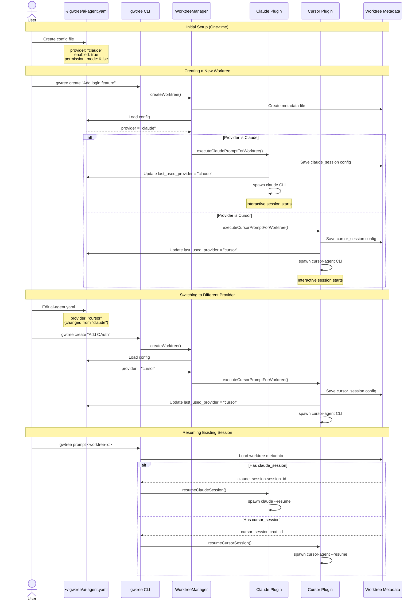

# AI Agent Plugin Flow

This document explains how users interact with AI agents (Claude or Cursor) when creating and working with worktrees.

## Overview

The system supports two AI agent providers:
- **Claude** - Claude CLI (`claude`)
- **Cursor** - Cursor Agent CLI (`cursor-agent`)

Users configure their preferred provider globally, and the system automatically launches the selected agent when creating worktrees.

## User Flow



## Configuration States

### State 1: Claude Enabled (Default)

**File: `~/.gwtree/ai-agent.yaml`**
```yaml
enabled: true
provider: "claude"
prompt_template: |
  You are my coding assistant...
permission_mode: false
```

**Behavior:**
- New worktrees launch Claude CLI
- Sessions tracked with `session_id` (UUID)
- Resume with `claude --resume <session_id>`

### State 2: Cursor Enabled

**File: `~/.gwtree/ai-agent.yaml`**
```yaml
enabled: true
provider: "cursor"
prompt_template: |
  You are my coding assistant...
permission_mode: false
last_used_provider: "cursor"
```

**Behavior:**
- New worktrees launch Cursor Agent CLI
- Sessions tracked with `chat_id` (UUID)
- Resume with `cursor-agent --resume <chat_id>`

### State 3: Disabled

**File: `~/.gwtree/ai-agent.yaml`**
```yaml
enabled: false
provider: "claude"
prompt_template: |
  You are my coding assistant...
permission_mode: false
```

**Behavior:**
- No AI agent launched on worktree creation
- Worktrees created normally without assistant

## Common User Scenarios

### Scenario 1: First Time Setup

```bash
# System detects no config exists
gwtree create "Add feature"

# No AI agent launches (config missing)
# User creates config manually:
cat > ~/.gwtree/ai-agent.yaml <<EOF
enabled: true
provider: "claude"
permission_mode: false
EOF

# Next worktree creation launches Claude
gwtree create "Add another feature"
# → Claude CLI launches automatically
```

### Scenario 2: Switching from Claude to Cursor

```bash
# Current setup uses Claude
cat ~/.gwtree/ai-agent.yaml
# provider: "claude"

# Edit config to switch
sed -i '' 's/claude/cursor/g' ~/.gwtree/ai-agent.yaml

# Next worktree uses Cursor
gwtree create "New feature"
# → Cursor Agent CLI launches automatically
```

### Scenario 3: Resuming Sessions

```bash
# Resume whatever agent was used for this worktree
gwtree prompt my-feature-branch

# System checks metadata:
# - If claude_session exists → launches Claude
# - If cursor_session exists → launches Cursor
```

### Scenario 4: Legacy Migration

```bash
# User has old config
cat ~/.gwtree/claude-prompt.yaml
# enabled: true
# permission_mode: false

# First run migrates automatically
gwtree create "Feature"
# → Migrates to ~/.gwtree/ai-agent.yaml
# → Deletes ~/.gwtree/claude-prompt.yaml
# → Sets provider: "claude"
```

## Technical Details

### Provider Selection Logic

```typescript
// In WorktreeManager.createWorktree()
const aiConfig = await loadGlobalAIAgentConfig();

if (aiConfig?.enabled) {
  if (aiConfig.provider === "claude" || !aiConfig.last_used_provider) {
    // Launch Claude
    await executeClaudePromptForWorktree(...)
  } else if (aiConfig.provider === "cursor") {
    // Launch Cursor
    await executeCursorPromptForWorktree(...)
  }
}
```

### Session Persistence

**Claude Session in Metadata:**
```yaml
claude_session:
  enabled: true
  session_id: "9f7bfa3c-fe8c-405a-bb86-c2c5f9a904b0"
  created_at: "2025-10-25T20:00:00Z"
  last_resumed_at: "2025-10-26T10:00:00Z"
  prompt_template: "You are my coding assistant..."
```

**Cursor Session in Metadata:**
```yaml
cursor_session:
  enabled: true
  chat_id: "a1b2c3d4-e5f6-7890-abcd-ef1234567890"
  created_at: "2025-10-25T20:00:00Z"
  last_resumed_at: "2025-10-26T10:00:00Z"
  prompt_template: "You are my coding assistant..."
```

### CLI Differences

| Feature | Claude | Cursor |
|---------|--------|--------|
| Binary | `claude` | `cursor-agent` |
| Session Flag | `--session-id <uuid>` | Sets env var `CURSOR_CHAT_ID` |
| Resume Flag | `--resume <session_id>` | `--resume <chat_id>` |
| Permission Flag | `--dangerously-skip-permissions` | `--force` |
| Working Directory | `cwd` option in spawn | `cd <path> && cursor-agent` |

## Summary

1. **One config controls both**: `~/.gwtree/ai-agent.yaml`
2. **Provider selection**: Set `provider: "claude"` or `provider: "cursor"`
3. **Automatic launching**: Agent starts when creating worktrees
4. **Session persistence**: Each worktree remembers which agent it used
5. **Smart resuming**: `gwtree prompt` launches the correct agent
6. **Last used tracking**: System remembers which provider was used last
7. **Legacy migration**: Old `claude-prompt.yaml` configs auto-migrate
